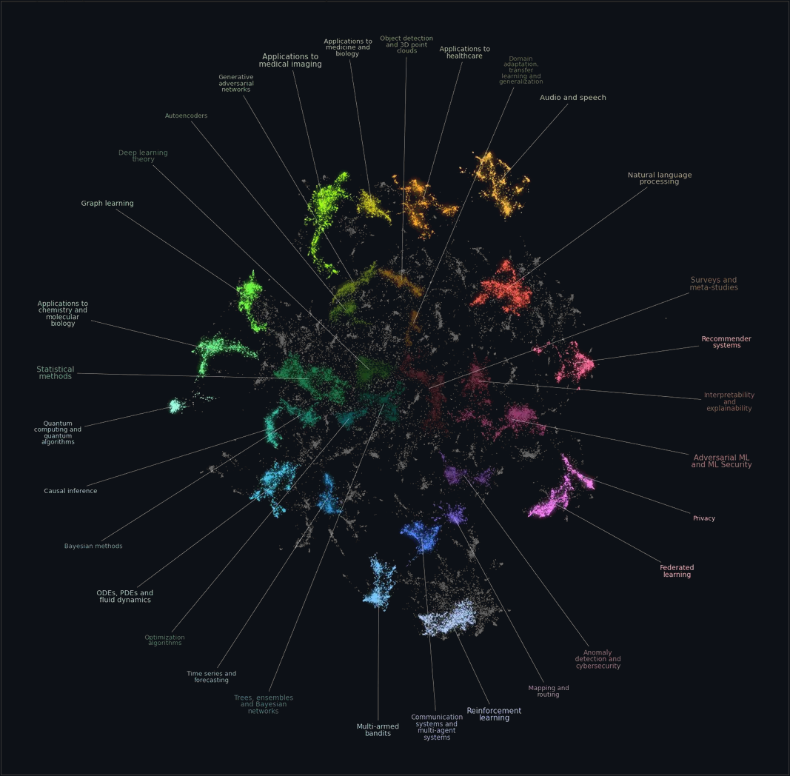

# arXiv Paper Classifier



["Good artists copy, great artists steal" - Picasso](https://www.reddit.com/r/dataisbeautiful/comments/18b1qrd/oc_a_data_map_of_machine_learning_papers_on_arxiv/)

This project develops an end-to-end ML pipeline for classifying scientific research papers into subject categories based on their textual content. The goal is to build a system that can ingest paper metadata and predict relevant research domains, with emphasis on robust MLOps practices including reproducibility, containerization, continuous integration, and cloud deployment.

## Data

We will use this arXiv dataset from Kaggle, which contains metadata for approximately 2.4 million papers including titles, abstracts, author lists, and hierarchical category labels.

https://www.kaggle.com/datasets/Cornell-University/arxiv

### Setup

Install dependencies:

```bash
uv sync                 # CPU (default)
uv sync --extra cuda    # NVIDIA GPU
uv sync --extra rocm    # AMD GPU (Ubuntu only. Requires ROCm installed)
```

Data is tracked with DVC and stored in GCS. To pull:

```bash
uv run dvc pull --no-run-cache
```

To update data after modifications:

```bash
uv run dvc add data/
uv run dvc push --no-run-cache
git add data.dvc && git commit -m "Update data" && git push
```

For initial development and faster iteration, we subsample to a manageable subset focusing on categories with clear boundaries. The arXiv category taxonomy provides ground truth labels for supervised training without requiring manual annotation. The arXiv category taxonomy can be found here

https://arxiv.org/category_taxonomy

## Get started

```bash
uv run invoke preproccess-data
uv run invoke train
uv run invoke test
```

## Training

```bash
Usage:
# Default (scibert_frozen)
invoke train

# Compare different models
invoke train --experiment sentence_transformer
invoke train --experiment scibert_full
invoke train --experiment scibert_frozen

# Quick iteration
invoke train --experiment sentence_transformer --max-samples 10000 --epochs 3

# Disable W&B logging
invoke train --wandb-mode disabled

# Direct Hydra overrides
uv run python -m arxiv_classifier.train experiment=sentence_transformer training.batch_size=256
```

## Model

We will use pretrained transformer models for multi-label text classification, with the input being concatenated title and abstract and the output a probability distribution over target categories. Scientific text contains domain-specific terminology that benefits from pretrained representations, so we avoid training from scratch.

Our initial approach scales with available compute. The baseline is sentence-transformers to embed abstracts into fixed vectors, followed by a lightweight classifier (logistic regression or small MLP). This requires no GPU for training since embeddings can be precomputed. 

If we need better performance, we can fine-tune sciBERT (~66M parameters) with a frozen base, updating only the classification head, with access to an RTX 4070 (12GB VRAM).

We start with the embedding approach to build out the pipeline, then swap in fine-tuning once the MLOps infrastructure is in place.

## Focus

The primary focus of this project is the MLOps infrastructure surrounding the model rather than achieving state-of-the-art classification performance. Key components include: version-controlled data using DVC and Google cloud storage, containerized training and inference environments with Docker, experiment tracking and hyperparameter logging with Weights and Biases, configuration management using Hydra, CI/CD pipelines via GitHub Actions for automated testing and linting and deployment of inference as a FastAPI service on Cloud Run.

## Deliverable

The deliverable is a functioning classification API with documented model performance, reproducible training pipeline, and comprehensive MLOps tooling as specified in the course requirements.

## Project Organization

```
├── .github/workflows/      <- GitHub Actions CI/CD workflows
│   ├── docker-build.yaml   <- Build and push Docker images to GCP Artifact Registry
│   ├── linting.yaml        <- Code formatting checks with ruff
│   ├── pre-commit-update.yaml
│   └── tests.yaml          <- Run pytest on multiple OS/Python versions
│
├── configs/                <- Hydra configuration files
│   ├── config.yaml         <- Base configuration
│   └── experiment/         <- Experiment-specific overrides
│       ├── scibert_frozen.yaml
│       ├── scibert_full.yaml
│       └── sentence_transformer.yaml
│
├── data/
│   ├── processed/          <- Preprocessed tensors ready for training
│   ├── processed.dvc       <- DVC tracking file for processed data
│   └── raw/                <- Original arXiv metadata
│
├── dockerfiles/
│   ├── api.dockerfile      <- FastAPI inference service
│   └── train.dockerfile    <- Training environment
│
├── docs/                   <- Documentation (mkdocs)
│   └── source/
│       ├── cloud_deployment.md
│       ├── index.md
│       └── profiling.md
│
├── models/                 <- Saved model checkpoints (.pt files)
│
├── reports/
│   └── figures/            <- Generated plots (category distributions, etc.)
│
├── src/arxiv_classifier/   <- Source code
│   ├── api.py              <- FastAPI application for inference
│   ├── data.py             <- Dataset classes and preprocessing
│   ├── evaluate.py         <- Model evaluation utilities
│   ├── model.py            <- Model factory and loading
│   ├── train.py            <- Training loop with Hydra config
│   ├── training_output.py  <- Progress bars of GPU stats and logging utilities
│   ├── visualize.py        <- Visualization scripts
│   └── models/             <- Model architectures
│       ├── base.py         <- Abstract base classifier
│       ├── scibert.py      <- SciBERT fine-tuning model
│       └── sentence_transformer.py  <- Frozen encoder + MLP head
│
├── tests/                  <- Test suite
│   ├── test_api.py         <- API endpoint tests
│   ├── test_data.py        <- Data loading tests
│   ├── test_model.py       <- Model architecture tests
│   ├── test_train.py       <- Training loop tests
│   └── locustfile.py       <- Load testing with Locust
│
├── .pre-commit-config.yaml <- Pre-commit hooks configuration
├── cloudbuild.yaml         <- GCP Cloud Build configuration
├── pyproject.toml          <- Project dependencies and metadata
├── tasks.py                <- Invoke tasks (train, test, preprocess)
└── uv.lock                 <- Locked dependencies
```
