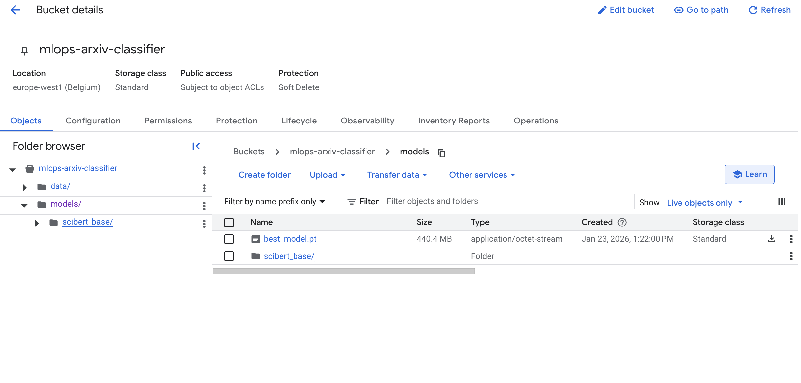
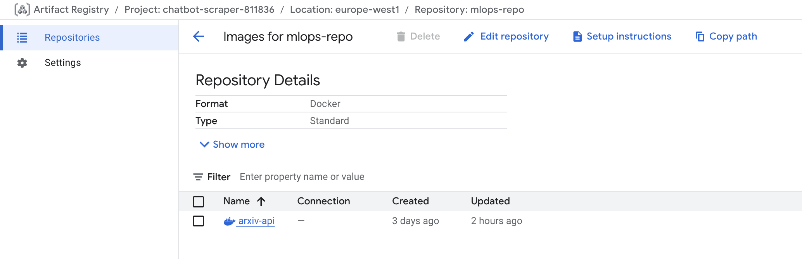
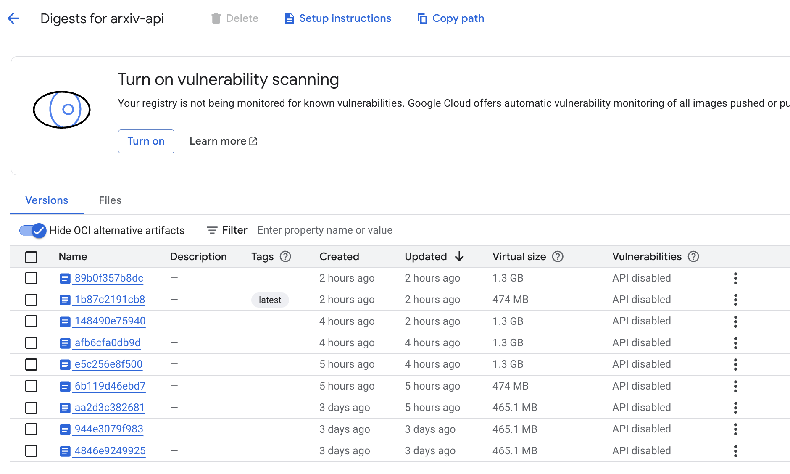
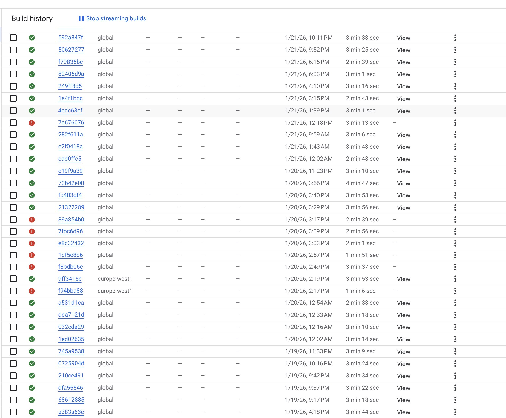
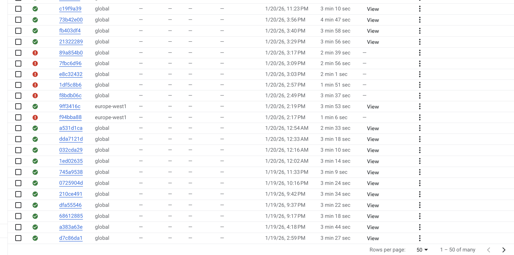

# Group 112 Final Report for 02476 Machine Learning Operations

**Chosen project: Classification of scientific papers**.

We create a model that can predict the research category of a scientific paper, given only its title and abstract.


## Overall project checklist

### Week 1

* [x] Create a git repository (M5)
* [x] Make sure that all team members have write access to the GitHub repository (M5)
* [x] Create a dedicated environment for you project to keep track of your packages (M2)
* [x] Create the initial file structure using cookiecutter with an appropriate template (M6)
* [x] Fill out the `data.py` file such that it downloads whatever data you need and preprocesses it (if necessary) (M6)
* [x] Add a model to `model.py` and a training procedure to `train.py` and get that running (M6)
* [x] Remember to either fill out the `requirements.txt`/`requirements_dev.txt` files or keeping your
    `pyproject.toml`/`uv.lock` up-to-date with whatever dependencies that you are using (M2+M6)
* [x] Remember to comply with good coding practices (`pep8`) while doing the project (M7)
* [x] Do a bit of code typing and remember to document essential parts of your code (M7)
* [x] Setup version control for your data or part of your data (M8)
* [x] Add command line interfaces and project commands to your code where it makes sense (M9)
* [x] Construct one or multiple docker files for your code (M10)
* [x] Build the docker files locally and make sure they work as intended (M10)
* [x] Write one or multiple configurations files for your experiments (M11)
* [x] Used Hydra to load the configurations and manage your hyperparameters (M11)
* [ ] Use profiling to optimize your code (M12)
* [x] Use logging to log important events in your code (M14)
* [x] Use Weights & Biases to log training progress and other important metrics/artifacts in your code (M14)
* [ ] Consider running a hyperparameter optimization sweep (M14)
* [ ] Use PyTorch-lightning (if applicable) to reduce the amount of boilerplate in your code (M15)

### Week 2

* [x] Write unit tests related to the data part of your code (M16)
* [x] Write unit tests related to model construction and or model training (M16)
* [x] Calculate the code coverage (M16)
* [x] Get some continuous integration running on the GitHub repository (M17)
* [x] Add caching and multi-os/python/pytorch testing to your continuous integration (M17)
* [x] Add a linting step to your continuous integration (M17)
* [x] Add pre-commit hooks to your version control setup (M18)
* [ ] Add a continues workflow that triggers when data changes (M19)
* [ ] Add a continues workflow that triggers when changes to the model registry is made (M19)
* [x] Create a data storage in GCP Bucket for your data and link this with your data version control setup (M21)
* [x] Create a trigger workflow for automatically building your docker images (M21)
* [ ] Get your model training in GCP using either the Engine or Vertex AI (M21)
* [x] Create a FastAPI application that can do inference using your model (M22)
* [x] Deploy your model in GCP using either Functions or Run as the backend (M23)
* [x] Write API tests for your application and setup continues integration for these (M24)
* [x] Load test your application (M24)
* [ ] Create a more specialized ML-deployment API using either ONNX or BentoML, or both (M25)
* [ ] Create a frontend for your API (M26)

### Week 3

* [ ] Check how robust your model is towards data drifting (M27)
* [ ] Setup collection of input-output data from your deployed application (M27)
* [ ] Deploy to the cloud a drift detection API (M27)
* [x] Instrument your API with a couple of system metrics (M28)
* [x] Setup cloud monitoring of your instrumented application (M28)
* [x] Create one or more alert systems in GCP to alert you if your app is not behaving correctly (M28)
* [x] If applicable, optimize the performance of your data loading using distributed data loading (M29)
* [ ] If applicable, optimize the performance of your training pipeline by using distributed training (M30)
* [ ] Play around with quantization, compilation and pruning for you trained models to increase inference speed (M31)

### Extra

* [x] Write some documentation for your application (M32)
* [ ] Publish the documentation to GitHub Pages (M32)
* [x] Revisit your initial project description. Did the project turn out as you wanted?
* [x] Create an architectural diagram over your MLOps pipeline
* [x] Make sure all group members have an understanding about all parts of the project
* [x] Uploaded all your code to GitHub

## Group information

### Question 1
> **Enter the group number you signed up on <learn.inside.dtu.dk>**
>
> Answer:

Group 112

### Question 2
> **Enter the study number for each member in the group**
>
> Example:
>
> *sXXXXXX, sXXXXXX, sXXXXXX*
>
> Answer:

*s224175, s224183, s224766*

### Question 3
> **Did you end up using any open-source frameworks/packages not covered in the course during your project? If so**
> **which did you use and how did they help you complete the project?**
>
> Recommended answer length: 0-200 words.
>
> Example:
> *We used the third-party framework ... in our project. We used functionality ... and functionality ... from the*
> *package to do ... and ... in our project*.
>
> Answer:

We used several third-party packages not covered in the course:

- **HuggingFace Transformers** for loading the pre-trained SciBERT model (`allenai/scibert_scivocab_cased`), which we fine-tune for paper classification.
- **sentence-transformers** for generating text embeddings without fine-tuning, used in our frozen encoder baseline model.
- **nvitop** for real-time GPU monitoring during training, displaying utilization, temperature, memory, and power consumption in our custom progress bars.
- **PEFT** (Parameter-Efficient Fine-Tuning) from HuggingFace for potential LoRA-based fine-tuning experiments.
- **Modal** as an alternative serverless GPU platform for cloud training, though we exhausted the free credits quickly.

## Coding environment

> In the following section we are interested in learning more about you local development environment. This includes
> how you managed dependencies, the structure of your code and how you managed code quality.

### Question 4

> **Explain how you managed dependencies in your project? Explain the process a new team member would have to go**
> **through to get an exact copy of your environment.**
>
> Recommended answer length: 100-200 words
>
> Example:
> *We used ... for managing our dependencies. The list of dependencies was auto-generated using ... . To get a*
> *complete copy of our development environment, one would have to run the following commands*
>
> Answer:

We use **uv** for dependency management. All dependencies are declared in `pyproject.toml` with exact versions locked in `uv.lock` for reproducibility. We define optional dependency groups for different hardware: `cuda` for NVIDIA GPUs and `rocm` for AMD GPUs on Linux.

A new team member would run:

```bash
git clone https://github.com/nicholaseruplarsen/mlops-02476
cd mlops-02476
uv sync                    # CPU-only PyTorch (default)
uv sync --extra cuda       # or: NVIDIA GPU support
uv sync --extra rocm       # or: AMD GPU support (Linux)
uv run dvc pull --no-run-cache  # pull data from GCS (requires credentials)
```

This gives them an exact replica of our development environment with all pinned dependencies.

### Question 5

> **We expect that you initialized your project using the cookiecutter template. Explain the overall structure of your**
> **code. What did you fill out? Did you deviate from the template in some way?**
>
> Recommended answer length: 100-200 words
>
> Example:
> *From the cookiecutter template we have filled out the ... , ... and ... folder. We have removed the ... folder*
> *because we did not use any ... in our project. We have added an ... folder that contains ... for running our*
> *experiments.*
>
> Answer:

From the cookiecutter template we filled out the `src/arxiv_classifier/` folder with our main application code including `data.py` for data loading and preprocessing, `train.py` for the training loop, `api.py` for the FastAPI inference service, and a `models/` subfolder containing `base.py`, `scibert.py`, and `sentence_transformer.py` for our model implementations.

We populated the `tests/` folder with unit tests for data, models, training, and API endpoints. We added a `configs/` folder with Hydra configuration files (`config.yaml` and `experiment/` subdirectory) which was not part of the original template. We also added a `dockerfiles/` folder containing `api.dockerfile` and `train.dockerfile` for containerization. The `.github/workflows/` folder was extended with CI/CD pipelines for testing, linting, and Docker builds. We kept the standard `data/` folder structure with `raw/` and `processed/` subdirectories managed by DVC.

### Question 6

> **Did you implement any rules for code quality and format? What about typing and documentation? Additionally,**
> **explain with your own words why these concepts matters in larger projects.**
>
> Recommended answer length: 100-200 words.
>
> Example:
> *We used ... for linting and ... for formatting. We also used ... for typing and ... for documentation. These*
> *concepts are important in larger projects because ... . For example, typing ...*
>
> Answer:

We use **Ruff** for both linting and formatting, configured in `pyproject.toml` with a line length of 120 characters. Ruff checks are enforced in our CI pipeline via `.github/workflows/linting.yaml` which runs `ruff check` and `ruff format --check` on every push and pull request. We also use **pre-commit hooks** configured in `.pre-commit-config.yaml` that run automatically before each commit, checking for trailing whitespace, ensuring files end with newlines, validating YAML syntax, and blocking large files (>500KB).

For typing, we use Python type hints throughout our codebase, particularly in the API schemas (Pydantic models) and model interfaces. Documentation is provided through docstrings in key modules. These practices matter in larger projects because they ensure consistency across multiple contributors, catch errors early before they reach production, make the codebase more maintainable, and reduce cognitive load when reading unfamiliar code.

## Version control

> In the following section we are interested in how version control was used in your project during development to
> corporate and increase the quality of your code.

### Question 7

> **How many tests did you implement and what are they testing in your code?**
>
> Recommended answer length: 50-100 words.
>
> Example:
> *In total we have implemented X tests. Primarily we are testing ... and ... as these the most critical parts of our*
> *application but also ... .*
>
> Answer:

In total we have implemented **28 tests** across 4 test files.

We have 2 tests in `test_data.py` verifying data loading and label validity across all splits.

We have 9 tests in `test_model.py` testing SciBERT and SentenceTransformer forward passes, predictions, layer freezing behavior, and the model registry.

We have 7 tests in `test_train.py` covering the text collation function, single training steps for both model types, model save/load, and gradient flow verification.

Finally, we have 10 tests in `test_api.py` testing our FastAPI endpoints including health checks, prediction validation, error handling, and edge cases.

### Question 8

> **What is the total code coverage (in percentage) of your code? If your code had a code coverage of 100% (or close**
> **to), would you still trust it to be error free? Explain you reasoning.**
>
> Recommended answer length: 100-200 words.
>
> Example:
> *The total code coverage of code is X%, which includes all our source code. We are far from 100% coverage of our **
> *code and even if we were then...*
>
> Answer:

Our total code coverage is **35%**. Key modules:

| Module | Coverage |
|--------|----------|
| models/base.py | 93% |
| models/scibert.py | 81% |
| models/sentence_transformer.py | 74% |
| api.py | 66% |
| data.py | 25% |
| train.py | 18% |
| visualize.py, modal_train.py | 0% (auxiliary) |

Core modules (model architectures, API) have reasonable coverage. Files like `visualize.py` and `modal_train.py` are auxiliary scripts not critical to the pipeline.

Even with 100% coverage, we couldn't guarantee error-free code. Coverage measures line *execution*, not logical *correctness*. A test could hit the prediction endpoint and check for 200 OK, but assert the wrong category. So coverage would show 100%, yet the bug goes undetected. Coverage also misses edge cases, integration bugs, race conditions, and performance issues. Tests are limited by what we think to test for.


### Question 9

> **Did you workflow include using branches and pull requests? If yes, explain how. If not, explain how branches and**
> **pull request can help improve version control.**
>
> Recommended answer length: 100-200 words.
>
> Example:
> *We made use of both branches and PRs in our project. In our group, each member had an branch that they worked on in*
> *addition to the main branch. To merge code we ...*
>
> Answer:

Yes, our main branch is protected from direct pushes. Instead, we use feature branches: whenever we implement new functionality, we create a branch with a descriptive name (e.g., `cloud-deployment-api-test`, `dockerbuild-trigger`). We then open pull requests from the specific feature branches, and merging is only allowed when all four GitHub Actions workflows pass: tests, linting, docker-build, and pre-commit-update. PRs also allow team members to review each other's code before merging.

This workflow keeps our commit history clean, ensures branches are scoped to specific features, and guarantees that main always works. We don't break anything when merging because CI has already validated the changes.

### Question 10

> **Did you use DVC for managing data in your project? If yes, then how did it improve your project to have version**
> **control of your data. If no, explain a case where it would be beneficial to have version control of your data.**
>
> Recommended answer length: 100-200 words.
>
> Example:
> *We did make use of DVC in the following way: ... . In the end it helped us in ... for controlling ... part of our*
> *pipeline*
>
> Answer:

Yes, we used DVC to track our preprocessed data (tensors and label encoder), backed by Google Cloud Storage. The raw arXiv data we fetched directly from Kaggle to save space on GCS.

The main benefits we got from DVC were: (1) any team member can run `dvc pull` to get the exact same data without manually managing GCS paths, and (2) our CI pipeline pulls data automatically to run tests. If we had iterated on preprocessing or deployed the model with incoming papers, versioning would also let us reproduce past experiments and monitor data drift. We didn't fully exploit this since our preprocessing was stable throughout the project.

### Question 11

> **Discuss you continuous integration setup. What kind of continuous integration are you running (unittesting,**
> **linting, etc.)? Do you test multiple operating systems, Python  version etc. Do you make use of caching? Feel free**
> **to insert a link to one of your GitHub actions workflow.**
>
> Recommended answer length: 200-300 words.
>
> Example:
> *We have organized our continuous integration into 3 separate files: one for doing ..., one for running ... testing*
> *and one for running ... . In particular for our ..., we used ... .An example of a triggered workflow can be seen*
> *here: <weblink>*
>
> Answer:

We have four GitHub Actions workflows in `.github/workflows/`:

1. **tests.yaml**: Runs our 28 unit tests with pytest across three operating systems (Ubuntu, Windows, macOS) on Python 3.12. It authenticates to GCP, pulls data via DVC, and enforces a minimum coverage threshold of 20%. We cache the DVC data using `actions/cache@v4` keyed on the hash of `data/processed.dvc`, so unchanged data is not re-downloaded.

2. **linting.yaml**: Runs `ruff check` for linting errors and `ruff format --check` to verify code formatting. This runs on Ubuntu only since linting results are platform-independent. Failing this check blocks PRs from being merged.

3. **docker-build.yaml**: Builds and pushes our API and training Docker images to Google Artifact Registry. This workflow only triggers when relevant files change (`src/**`, `dockerfiles/**`, `pyproject.toml`, `uv.lock`). It uses Docker Buildx with GitHub Actions cache (`cache-from: type=gha`) to speed up builds. Images are tagged with both `latest` and the git SHA.

4. **pre-commit-update.yaml**: Runs daily on a cron schedule to auto-update pre-commit hook versions and opens a PR if updates are available.

All workflows (except pre-commit-update) trigger on pushes and PRs to main. Our branch protection rules ensure PRs cannot be merged until all checks pass, maintaining code quality and stability of the main branch.

Example workflow run: https://github.com/nicholaseruplarsen/mlops-02476/actions/workflows/tests.yaml

## Running code and tracking experiments

> In the following section we are interested in learning more about the experimental setup for running your code and
> especially the reproducibility of your experiments.

### Question 12

> **How did you configure experiments? Did you make use of config files? Explain with coding examples of how you would**
> **run a experiment.**
>
> Recommended answer length: 50-100 words.
>
> Example:
> *We used a simple argparser, that worked in the following way: Python  my_script.py --lr 1e-3 --batch_size 25*
>
> Answer:

--- question 12 fill here ---

### Question 13

> **Reproducibility of experiments are important. Related to the last question, how did you secure that no information**
> **is lost when running experiments and that your experiments are reproducible?**
>
> Recommended answer length: 100-200 words.
>
> Example:
> *We made use of config files. Whenever an experiment is run the following happens: ... . To reproduce an experiment*
> *one would have to do ...*
>
> Answer:

--- question 13 fill here ---

### Question 14

> **Upload 1 to 3 screenshots that show the experiments that you have done in W&B (or another experiment tracking**
> **service of your choice). This may include loss graphs, logged images, hyperparameter sweeps etc. You can take**
> **inspiration from [this figure](figures/wandb.png). Explain what metrics you are tracking and why they are**
> **important.**
>
> Recommended answer length: 200-300 words + 1 to 3 screenshots.
>
> Example:
> *As seen in the first image when have tracked ... and ... which both inform us about ... in our experiments.*
> *As seen in the second image we are also tracking ... and ...*
>
> Answer:

--- question 14 fill here ---

### Question 15

> **Docker is an important tool for creating containerized applications. Explain how you used docker in your**
> **experiments/project? Include how you would run your docker images and include a link to one of your docker files.**
>
> Recommended answer length: 100-200 words.
>
> Example:
> *For our project we developed several images: one for training, inference and deployment. For example to run the*
> *training docker image: `docker run trainer:latest lr=1e-3 batch_size=64`. Link to docker file: <weblink>*
>
> Answer:
We used the dockerfiles/api.dockerfile for FastAPI inference. We used dockerfiles/train.dockerfile for training
Since we used a pretrained model and training was quite long even on a good GPU, we only did 1 training and didnt do multiple experiments
We have used github actions to automatically build and push to GCP Artifact Registry on pull to main


### Question 16

> **When running into bugs while trying to run your experiments, how did you perform debugging? Additionally, did you**
> **try to profile your code or do you think it is already perfect?**
>
> Recommended answer length: 100-200 words.
>
> Example:
> *Debugging method was dependent on group member. Some just used ... and others used ... . We did a single profiling*
> *run of our main code at some point that showed ...*
>
> Answer:

For debugging, we primarily used VS Code's built-in debugger with breakpoints to step through code and inspect variables. This was particularly useful when debugging data loading issues and model forward passes. For quick checks, we also used print statements and the loguru logger to trace execution flow.

For profiling, we experimented with two tools: snakeviz for CPU profiling (visualizing cProfile output) and TensorBoard with PyTorch's profiler for analyzing training performance. We documented the TensorBoard setup in `docs/source/profiling.md`. However, the profiling did not lead to any concrete optimizations. Our training bottleneck was simply the transformer model's forward/backward passes, which is expected and not something we could optimize without changing the model architecture. The data loading pipeline was already using multiple workers, pinned memory, and prefetching, so there was no low-hanging fruit there either.

## Working in the cloud

> In the following section we would like to know more about your experience when developing in the cloud.

### Question 17

> **List all the GCP services that you made use of in your project and shortly explain what each service does?**
>
> Recommended answer length: 50-200 words.
>
> Example:
> *We used the following two services: Engine and Bucket. Engine is used for... and Bucket is used for...*
>
> Answer:

We used Google Cloud Run Services and we used Buckets.
Buckets were used to store our model so we could load the model in the service container
Run services is used to have an instance open always for cloud API requests. I found the differences here between a run job and a run service is that it is always instead of needing a cold boot, so the api is faster.
We also spent some money on cloud build to build the docker files, but its cheap
Ended up wasting a bit of money on the services not letting it idle :D, but didnt exceed 50 dollars


### Question 18

> **The backbone of GCP is the Compute engine. Explained how you made use of this service and what type of VMs**
> **you used?**
>
> Recommended answer length: 100-200 words.
>
> Example:
> *We used the compute engine to run our ... . We used instances with the following hardware: ... and we started the*
> *using a custom container: ...*
>
> Answer:

We used Compute Engine briefly to test deploying our API. We spun up a standard VM instance, pulled our Docker image from Artifact Registry, and ran the FastAPI container. It was satisfying to see the API respond to POST requests from our local machines. However, we did not have access to the free student credits, so running a VM continuously was too costly. We ended up spending around 125 DKK on cloud resources for this project.

For the same reason, we did not use Compute Engine (or Vertex AI) for training. Instead, we trained locally on our own hardware (RTX 4070 with 12GB VRAM), which was faster and free. The cloud VM was useful for validating that our containerized deployment worked end-to-end, but we ultimately moved to Cloud Run for the final deployment since it scales to zero and only charges for actual requests.

### Question 19

> **Insert 1-2 images of your GCP bucket, such that we can see what data you have stored in it.**
> **You can take inspiration from [this figure](figures/bucket.png).**
>
> Answer:
> **


### Question 20

> **Upload 1-2 images of your GCP artifact registry, such that we can see the different docker images that you have**
> **stored. You can take inspiration from [this figure](figures/registry.png).**
>
> Answer:
> *This is what we have in artifact registry*




### Question 21

> **Upload 1-2 images of your GCP cloud build history, so we can see the history of the images that have been build in**
> **your project. You can take inspiration from [this figure](figures/build.png).**
>
> Answer:
We have a lot of builds here because I am also working on another personal project right now... i should have made this project it's own project i see that now :(





### Question 22

> **Did you manage to train your model in the cloud using either the Engine or Vertex AI? If yes, explain how you did**
> **it. If not, describe why.**
>
> Recommended answer length: 100-200 words.
>
> Example:
> *We managed to train our model in the cloud using the Engine. We did this by ... . The reason we choose the Engine*
> *was because ...*
>
> Answer:
We did not train our model on Google Cloud Engine, because one of our team members has a GTX 3070 which we used to train 2 long runs on the 2 models we have. We ended up using the best one for the API, which was the SciBert model.


## Deployment

### Question 23

> **Did you manage to write an API for your model? If yes, explain how you did it and if you did anything special. If**
> **not, explain how you would do it.**
>
> Recommended answer length: 100-200 words.
>
> Example:
> *We did manage to write an API for our model. We used FastAPI to do this. We did this by ... . We also added ...*
> *to the API to make it more ...*
>
> Answer:
We used FastAPI to setup API testing of our model.  We have used these endpoints: /predict for our paper classifcation model and we have used /metrics for Prometheus
We used Pydantic to validate request and responses such as making sure that we get inputs in the correct format and output is the correct format.

--- question 23 fill here ---

### Question 24

> **Did you manage to deploy your API, either in locally or cloud? If not, describe why. If yes, describe how and**
> **preferably how you invoke your deployed service?**
>
> Recommended answer length: 100-200 words.
>
> Example:
> *For deployment we wrapped our model into application using ... . We first tried locally serving the model, which*
> *worked. Afterwards we deployed it in the cloud, using ... . To invoke the service an user would call*
> *`curl -X POST -F "file=@file.json"<weburl>`*
>
> Answer:
We deployed our API on google cloud provider's run service. This means the container is always ready to recieve requests
The API can be quried like this:
'curl -X POST https://arxiv-api-pquab3rrka-ew.a.run.app/predict \
    -H "Content-Type: application/json" \
    -d '{"title": "Paper Title", "abstract": "Paper abstract text"}'
-

### Question 25

> **Did you perform any unit testing and load testing of your API? If yes, explain how you did it and what results for**
> **the load testing did you get. If not, explain how you would do it.**
>
> Recommended answer length: 100-200 words.
>
> Example:
> *For unit testing we used ... and for load testing we used ... . The results of the load testing showed that ...*
> *before the service crashed.*
>
> Answer:
We used pytest with FastAPI to create some mock test and to test throughput. local results showed:
  | Concurrent Users | Requests (30s) | Avg Latency | 95th %ile | Throughput |
  |------------------|----------------|-------------|-----------|------------|
  | 10               | 750            | 54ms        | 84ms      | ~27 req/s  |
  | 50               | 151            | 216ms       | 510ms     | ~5 req/s   |
. We can see the latency slowed with more "users".
We tried querying it 10000 times, but that didn't cause it to crash, but request latency degraded due to inference being bottlenecked by the CPU. This was on GCP not local.


### Question 26

> **Did you manage to implement monitoring of your deployed model? If yes, explain how it works. If not, explain how**
> **monitoring would help the longevity of your application.**
>
> Recommended answer length: 100-200 words.
>
> Example:
> *We did not manage to implement monitoring. We would like to have monitoring implemented such that over time we could*
> *measure ... and ... that would inform us about this ... behaviour of our application.*
>
> Answer:
We implemented monitoring wih prometheus to check for how many requests we take, requests handled, alert systems etc
We used Prometheus to check the length of the inputs we were getting, logs is in: reports/prometheus_metrics.md
We can see activity on the service running on google cloud
Lastly we used alerts to notify us when requests exceeded a certain amount. We got the email when the requests were above 3/s when stress testing for 500 requests
This monitoring allows us to check availability and function of our web service

## Overall discussion of project

> In the following section we would like you to think about the general structure of your project.

### Question 27

> **How many credits did you end up using during the project and what service was most expensive? In general what do**
> **you think about working in the cloud?**
>
> Recommended answer length: 100-200 words.
>
> Example:
> *Group member 1 used ..., Group member 2 used ..., in total ... credits was spend during development. The service*
> *costing the most was ... due to ... . Working in the cloud was ...*
>
> Answer:

We spent approximately 125 DKK (~$18 USD) on cloud credits during the project. We did not have access to the free student credits, so we paid out of pocket. The most expensive service was Compute Engine, where we briefly ran a VM to test our API deployment. Keeping a VM running continuously adds up quickly, which is why we moved to Cloud Run for the final deployment (it scales to zero when idle).

Other costs came from Cloud Storage (hosting our DVC data) and Artifact Registry (storing Docker images), but these were relatively cheap since we only stored a few gigabytes.

Working in the cloud was a valuable learning experience, but also frustrating at times. Setting up IAM permissions, service accounts, and connecting all the pieces (Artifact Registry, Cloud Run, GCS buckets) required a lot of trial and error. Once everything was configured, it worked smoothly. The pay-as-you-go model is great for production but makes experimentation feel expensive when you lack free credits.

### Question 28

> **Did you implement anything extra in your project that is not covered by other questions? Maybe you implemented**
> **a frontend for your API, use extra version control features, a drift detection service, a kubernetes cluster etc.**
> **If yes, explain what you did and why.**
>
> Recommended answer length: 0-200 words.
>
> Example:
> *We implemented a frontend for our API. We did this because we wanted to show the user ... . The frontend was*
> *implemented using ...*
>
> Answer:

--- question 28 fill here ---

### Question 29

> **Include a figure that describes the overall architecture of your system and what services that you make use of.**
> **You can take inspiration from [this figure](figures/overview.png). Additionally, in your own words, explain the**
> **overall steps in figure.**
>
> Recommended answer length: 200-400 words
>
> Example:
>
> *The starting point of the diagram is our local setup, where we integrated ... and ... and ... into our code.*
> *Whenever we commit code and push to GitHub, it auto triggers ... and ... . From there the diagram shows ...*
>
> Answer:

--- question 29 fill here ---

### Question 30

> **Discuss the overall struggles of the project. Where did you spend most time and what did you do to overcome these**
> **challenges?**
>
> Recommended answer length: 200-400 words.
>
> Example:
> *The biggest challenges in the project was using ... tool to do ... . The reason for this was ...*
>
> Answer:

--- question 30 fill here ---

### Question 31

> **State the individual contributions of each team member. This is required information from DTU, because we need to**
> **make sure all members contributed actively to the project. Additionally, state if/how you have used generative AI**
> **tools in your project.**
>
> Recommended answer length: 50-300 words.
>
> Example:
> *Student sXXXXXX was in charge of developing of setting up the initial cookie cutter project and developing of the*
> *docker containers for training our applications.*
> *Student sXXXXXX was in charge of training our models in the cloud and deploying them afterwards.*
> *All members contributed to code by...*
> *We have used ChatGPT to help debug our code. Additionally, we used GitHub Copilot to help write some of our code.*
> Answer:

--- question 31 fill here ---
